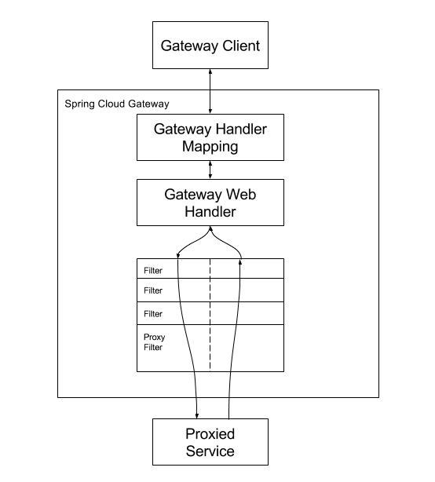

<h1>gateway-study</h1>

[中文网](https://springdoc.cn/spring-cloud-gateway/)

[官方地址](https://spring.io/projects/spring-cloud-gateway)

网关最重要的作用就是拦截和转发。

# 依赖

```xml
<dependencies>
    <dependency>
        <groupId>org.springframework.cloud</groupId>
        <artifactId>spring-cloud-starter-gateway</artifactId>
    </dependency>
    <dependency>
        <groupId>org.springframework.cloud</groupId>
        <artifactId>spring-cloud-starter-loadbalancer</artifactId>
    </dependency>
    <dependency>
        <groupId>com.alibaba.cloud</groupId>
        <artifactId>spring-cloud-starter-alibaba-nacos-discovery</artifactId>
        <version>${nacos.version}</version>
    </dependency>
</dependencies>

<dependencyManagement>
    <dependencies>
        <dependency>
            <groupId>org.springframework.cloud</groupId>
            <artifactId>spring-cloud-dependencies</artifactId>
            <version>${spring-cloud.version}</version>
            <type>pom</type>
            <scope>import</scope>
        </dependency>
    </dependencies>
</dependencyManagement>
```

# 三个关键词

- **Route（路由）**: 网关的基本构件。它由一个ID、一个目的地URI、一个谓词（Predicate）集合和一个过滤器（Filter）集合定义。如果集合谓词为真，则路由被匹配。
- **Predicate（谓词）**: 这是一个 [Java 8 Function Predicate](https://docs.oracle.com/javase/8/docs/api/java/util/function/Predicate.html)。输入类型是 [Spring Framework `ServerWebExchange`](https://docs.spring.io/spring/docs/5.0.x/javadoc-api/org/springframework/web/server/ServerWebExchange.html)。这让你可以在HTTP请求中的任何内容上进行匹配，比如header或查询参数。
- **Filter（过滤器）**: 这些是 [`GatewayFilter`](https://github.com/spring-cloud/spring-cloud-gateway/tree/main/spring-cloud-gateway-server/src/main/java/org/springframework/cloud/gateway/filter/GatewayFilter.java) 的实例，已经用特定工厂构建。在这里，你可以在发送下游请求之前或之后修改请求和响应。

# 工作流程



客户端向 Spring Cloud Gateway 发出请求。如果 Gateway 处理程序映射确定一个请求与路由相匹配，它将被发送到 Gateway Web 处理程序。这个处理程序通过一个特定于该请求的过滤器链来运行该请求。过滤器被虚线分割的原因是，过滤器可以在代理请求发送之前和之后运行逻辑。所有的 `"pre"` （前）过滤器逻辑都被执行。然后发出代理请求。在代理请求发出后，`"post"` （后）过滤器逻辑被运行。

# [GatewayFilter 工厂](https://springdoc.cn/spring-cloud-gateway/#gatewayfilter-工厂)

```yaml
server:
  port: 8001
  servlet:
    context-path: /

spring:
  application:
    name: gateway
  cloud:
    nacos:
      discovery:
        server-addr: localhost:8848
    gateway:
      routes:
        - id: service-route1
          uri: lb://service1
          predicates:
            - Path=/service1/test1/**
          filters:
            - AddRequestHeader=X-Request-Foo,Bar1
        - id: service-route2
          uri: lb://service1
          predicates:
            - Path=/service1/test2/**
          filters:
            - AddRequestHeader=X-Request-Foo,Bar2
      globalcors:
        cors-configurations: # 跨域配置
          '[/**]':
            allowedOrigins: "https://docs.spring.io"
            allowedMethods: "*"

```

# 全局 Filter

Ordered 只能配置同类型的 Filter 顺序(WebFilter 比 GlobalFilter 优先级高)

```java
@Component
public class MyWebFilter1 implements WebFilter, Ordered {
    @Override
    public Mono<Void> filter(ServerWebExchange exchange, WebFilterChain chain) {
        System.out.println("MyWebFilter1 is called");
        return chain.filter(exchange);
    }

    @Override
    public int getOrder() {
        return 10;
    }

}
```

```java
@Component
public class MyGlobalFilter1 implements GlobalFilter, Ordered {
    @Override
    public Mono<Void> filter(ServerWebExchange exchange, GatewayFilterChain chain) {
        System.out.println("MyGlobalFilter1 executed");
        return chain.filter(exchange);
    }

    @Override
    public int getOrder() {
        return 1;
    }
}
```
